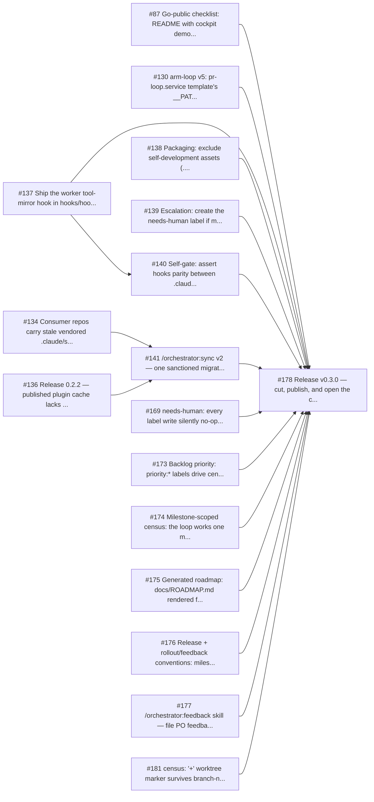
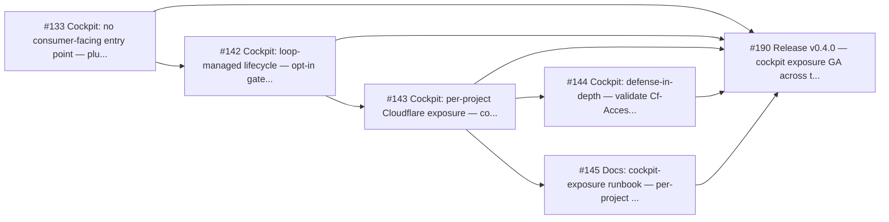

<!-- GENERATED FILE — DO NOT EDIT BY HAND. -->
<!-- Source of truth: GitHub milestones/issues/PRs. Regenerate with `bash .claude/scripts/roadmap.sh --write`. -->

# Roadmap

> **Generated — do not hand-edit.** This file is produced by `.claude/scripts/roadmap.sh` from live
> GitHub metadata (open milestones, issues, PRs, and "Blocked by" edges parsed from issue bodies).
> The single source of truth is GitHub itself — change labels/milestones/issue bodies there, then
> re-run `bash .claude/scripts/roadmap.sh --write`. Manual edits here will be overwritten.

## v0.3.0 — consumer rollout (#1 · 4 open / 12 closed)

| Issue | Priority | State | Blocked by |
|---|---|---|---|
| [#141](https://github.com/robercano/reCode/issues/141) /orchestrator:sync v2 — one sanctioned migration path to bring consumer repos current | 🔴 critical | closed | #134, #136 |
| [#187](https://github.com/robercano/reCode/issues/187) census: priority-sort pipeline breaks on milestone-assigned issues — stray 'milestone' output, wrong ordering, daemon ticks die to action=none (loop idle since 2026-07-21) | 🔴 critical | in_flight | — |
| [#87](https://github.com/robercano/reCode/issues/87) Go-public checklist: README with cockpit demo, LICENSE, contribution notes, publishing story | 🟠 high | closed | — |
| [#130](https://github.com/robercano/reCode/issues/130) arm-loop v5: pr-loop.service template's __PATH__ placeholder is never substituted → unit fails at boot with status=127 | 🟠 high | closed | — |
| [#137](https://github.com/robercano/reCode/issues/137) Ship the worker tool-mirror hook in hooks/hooks.json — cockpit live-workers panel is reCode-only | 🟠 high | closed | — |
| [#169](https://github.com/robercano/reCode/issues/169) needs-human: every label write silently no-ops (gh 2.4.0) — episode guard never arms, one PR comment per tick (99 spam comments on PR #168) | 🟠 high | closed | — |
| [#173](https://github.com/robercano/reCode/issues/173) Backlog priority: priority:* labels drive census ordering | 🟠 high | closed | — |
| [#174](https://github.com/robercano/reCode/issues/174) Milestone-scoped census: the loop works one milestone (sprint) at a time | 🟠 high | closed | — |
| [#176](https://github.com/robercano/reCode/issues/176) Release + rollout/feedback conventions: milestone-gated release issue, auto-filed rollout companion | 🟠 high | closed | — |
| [#181](https://github.com/robercano/reCode/issues/181) census: '+' worktree marker survives branch-name cleanup — open-PR branches misread as in_flight, false stall/resume/escalate | 🟠 high | closed | — |
| [#138](https://github.com/robercano/reCode/issues/138) Packaging: exclude self-development assets (.claude/self/) from the shipped plugin | 🟡 medium | open | — |
| [#139](https://github.com/robercano/reCode/issues/139) Escalation: create the needs-human label if missing, fail loudly otherwise | 🟡 medium | open | — |
| [#140](https://github.com/robercano/reCode/issues/140) Self-gate: assert hooks parity between .claude/settings.json and hooks/hooks.json | 🟡 medium | closed | #137 |
| [#175](https://github.com/robercano/reCode/issues/175) Generated roadmap: docs/ROADMAP.md rendered from GitHub state, regenerated per merge | 🟡 medium | closed | — |
| [#177](https://github.com/robercano/reCode/issues/177) /orchestrator:feedback skill — file PO feedback from consumer repos with autofilled metadata | 🟡 medium | closed | — |
| [#178](https://github.com/robercano/reCode/issues/178) Release v0.3.0 — cut, publish, and open the consumer-rollout feedback phase | ⚪ low | open | #87, #130, #137, #138, #139, #140, #141, #169, #173, #174, #175, #176, #177, #181 |

## v0.4.0 — cockpit everywhere (#2 · 6 open / 0 closed)

| Issue | Priority | State | Blocked by |
|---|---|---|---|
| [#133](https://github.com/robercano/reCode/issues/133) Cockpit: no consumer-facing entry point — plugin ships cockpit.sh but nothing can invoke it outside the self-hosted repo | 🔴 critical | open | — |
| [#142](https://github.com/robercano/reCode/issues/142) Cockpit: loop-managed lifecycle — opt-in gates.json cockpit block, start/stop with arm/halt | 🟠 high | open | #133 |
| [#143](https://github.com/robercano/reCode/issues/143) Cockpit: per-project Cloudflare exposure — cockpit-expose skill (named tunnel, Access-gated DNS, loop-scoped unit) | 🟠 high | open | #142 |
| [#144](https://github.com/robercano/reCode/issues/144) Cockpit: defense-in-depth — validate Cf-Access-Jwt-Assertion at the origin when tunneled | 🟡 medium | open | #143 |
| [#145](https://github.com/robercano/reCode/issues/145) Docs: cockpit-exposure runbook — per-project tunnel, Access-gated DNS, multi-project conventions, WSL2 autostart | 🟡 medium | open | #143 |
| [#190](https://github.com/robercano/reCode/issues/190) Release v0.4.0 — cockpit exposure GA across the family | ⚪ low | open | #133, #142, #143, #144, #145 |

## Feedback inbox

Open `feedback`-labeled issues not yet assigned a milestone (owner triage — see docs/USAGE.md's
"rollout & feedback companion" — turns into loop-eligible work once `planned` + a milestone land):

_No unmilestoned feedback issues._

---
_Generated 2026-07-29T11:08:55.589Z · commit `9e85703`_
